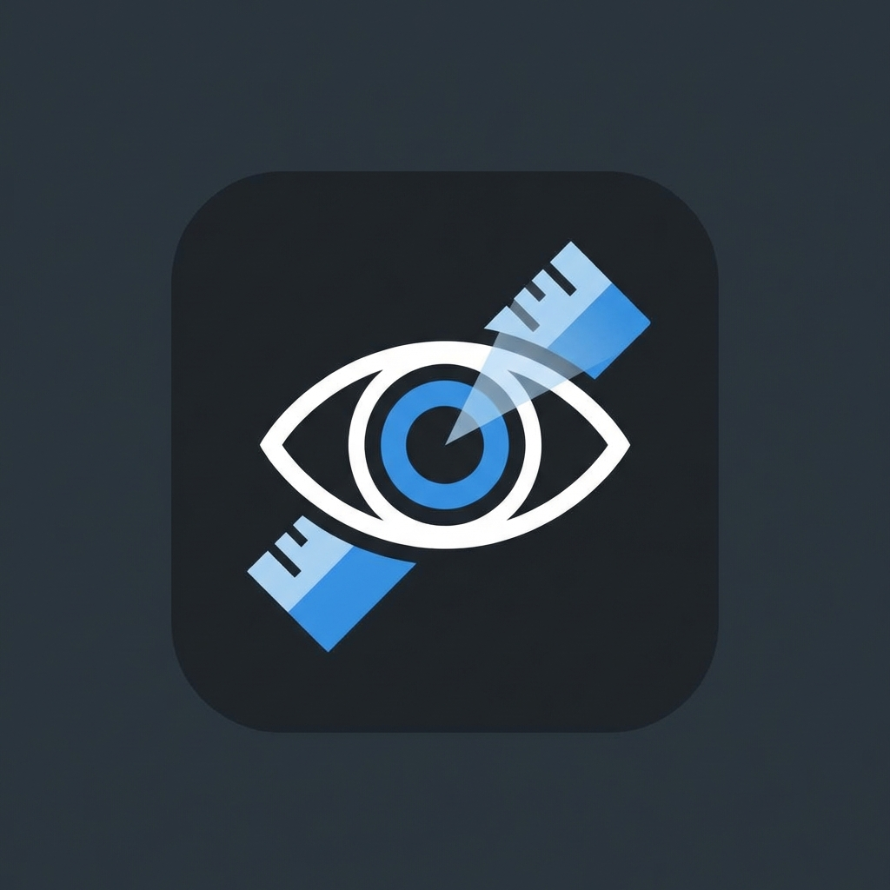

3. **Activer/Désactiver** :
   - Utilisez le gros interrupteur dans le tableau de bord.
   - Ou utilisez le raccourci clavier `Ctrl+Shift+F` (modifiable).
4. **Quitter** : Faites un clic droit sur l'icône dans la barre des tâches (en bas à droite) et choisissez "Quitter".

---

## 🇺🇸 English

### 📖 About
**Focus Visuel** is a desktop application designed to assist individuals with **ADHD**, **dyslexia**, or anyone looking to reduce visual strain upon large screens.

It creates a **dark overlay** across all your monitors, leaving only a **clear reading band** that follows your mouse cursor. This isolates you from on-screen distractions and guides your eyes, acting like a digital reading ruler.

### ✨ Key Features
- **Dynamic Reading Ruler**: A horizontal band follows your cursor in real-time.
- **Multi-Screen Support**: Automatically detects and manages all connected monitors. The focus band appears only on the active screen, dimming the others for total immersion.
- **Premium Dashboard**: A modern, Glassmorphism-styled interface for full control.
- **Fully Customizable**: Adjust the band height and background opacity to suit your needs.
- **Keyboard Shortcuts**: Toggle the tool instantly (Default: `Ctrl+Shift+F`).
- **Stealth Mode**: Silent launch with no terminal window, accessible via the system tray.

### 🚀 Installation
1. **Prerequisites**: Ensure you have [Node.js](https://nodejs.org/) installed.
2. **Download**: Clone this repository or download the files.
   ```bash
   git clone https://github.com/your-username/focus-visuel.git
   ```
3. **Install Dependencies**:
   Run `npm install` in your terminal within the project folder.

### 🎮 How to Use
1. **Launch**: Double-click the **`Lancer Sans Terminal.vbs`** file for a clean, silent start.
2. **Configure**: The app opens to the Dashboard. Adjust your settings here.
# 👁️ Focus Visuel

> **L'outil essentiel pour améliorer la lecture et la concentration sur écran.**  
> *The essential tool to improve reading and concentration on screen.*



## 🇫🇷 Français

### 📖 À propos
**Focus Visuel** est une application de bureau conçue pour aider les personnes souffrant de **troubles de l'attention (TDAH)**, de **dyslexie**, ou simplement pour tous ceux qui souhaitent réduire la fatigue visuelle sur de grands écrans. 

Elle crée un **voile sombre** sur l'ensemble de vos moniteurs, ne laissant apparaître qu'une **bande de lecture claire** qui suit votre souris. Cela permet de s'isoler des distractions et de guider le regard, comme une règle de lecture numérique.

### ✨ Fonctionnalités Clés
- **Règle de Lecture Dynamique** : Une bande horizontale suit votre curseur en temps réel.
- **Support Multi-Écrans** : Détecte et gère automatiquement tous vos moniteurs. Le focus s'active uniquement sur l'écran actif, assombrissant les autres pour une immersion totale.
- **Tableau de Bord Premium** : Une interface moderne (Glassmorphism) pour tout contrôler.
- **Personnalisation Complète** : Ajustez la hauteur de la bande et l'opacité du fond selon vos besoins.
- **Raccourcis Clavier** : Activez/Désactivez l'outil instantanément (Par défaut : `Ctrl+Shift+F`).
- **Mode Discret** : Lancement silencieux sans fenêtre de terminal, et icône dans la zone de notification.

### 🚀 Installation
1. **Prérequis** : Assurez-vous d'avoir [Node.js](https://nodejs.org/) installé sur votre ordinateur. *(Le fichier `Lancer Focus Visuel.bat` vérifiera cela pour vous et vous aidera à l'installer si nécessaire.)*
2. **Téléchargement** : Clonez ce dépôt ou téléchargez les fichiers.
   ```bash
   git clone https://github.com/PandaMC38/focus-visuel.git
   ```
3. **Installation des dépendances** :
   Double-cliquez sur le fichier `Lancer Focus Visuel.bat` une première fois, ou ouvrez un terminal et lancez :
   ```bash
   npm install
   ```

### 🎮 Utilisation
1. **Lancer l'application** : Double-cliquez sur le fichier **`Lancer Sans Terminal.vbs`** pour un démarrage propre et silencieux.
2. **Configurer** : L'application s'ouvre sur le Tableau de Bord. Ajustez vos préférences.
3. **Activer/Désactiver** :
   - Utilisez le gros interrupteur dans le tableau de bord.
   - Ou utilisez le raccourci clavier `Ctrl+Shift+F` (modifiable).
4. **Quitter** : Faites un clic droit sur l'icône dans la barre des tâches (en bas à droite) et choisissez "Quitter".

---

## 🇺🇸 English

### 📖 About
**Focus Visuel** is a desktop application designed to assist individuals with **ADHD**, **dyslexia**, or anyone looking to reduce visual strain upon large screens.

It creates a **dark overlay** across all your monitors, leaving only a **clear reading band** that follows your mouse cursor. This isolates you from on-screen distractions and guides your eyes, acting like a digital reading ruler.

### ✨ Key Features
- **Dynamic Reading Ruler**: A horizontal band follows your cursor in real-time.
- **Multi-Screen Support**: Automatically detects and manages all connected monitors. The focus band appears only on the active screen, dimming the others for total immersion.
- **Premium Dashboard**: A modern, Glassmorphism-styled interface for full control.
- **Fully Customizable**: Adjust the band height and background opacity to suit your needs.
- **Keyboard Shortcuts**: Toggle the tool instantly (Default: `Ctrl+Shift+F`).
- **Stealth Mode**: Silent launch with no terminal window, accessible via the system tray.

### 🚀 Installation
1. **Prerequisites**: Ensure you have [Node.js](https://nodejs.org/) installed. *(The `Lancer Focus Visuel.bat` file will check this for you and help you install it if needed.)*
2. **Download**: Clone this repository or download the files.
   ```bash
   git clone https://github.com/PandaMC38/focus-visuel.git
   ```
3. **Install Dependencies**:
   Run `npm install` in your terminal within the project folder.

### 🎮 How to Use
1. **Launch**: Double-click the **`Lancer Sans Terminal.vbs`** file for a clean, silent start.
2. **Configure**: The app opens to the Dashboard. Adjust your settings here.
3. **Toggle On/Off**:
   - Use the main switch in the Dashboard.
   - Or use the global shortcut `Ctrl+Shift+F` (customizable).
4. **Quit**: Right-click the tray icon (bottom right of your taskbar) and select "Quitter" (Quit).

---
*Developed with ❤️ using Electron.*